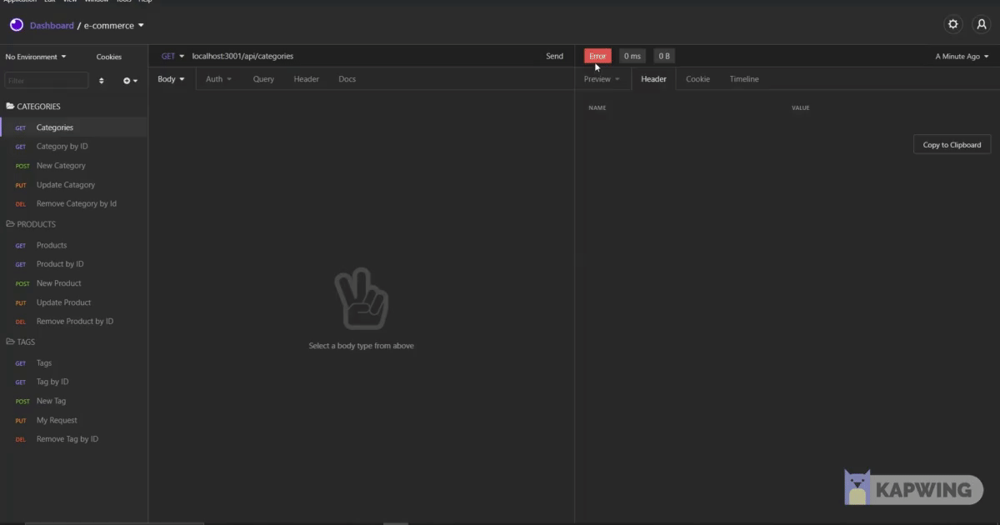

# 13 Object-Relational Mapping (ORM): E-Commerce Back End

## Description

Using a SQL database with multiple different pacakages, we will build the back end for a user to post, update, pull/delete categories, products and tags. All of these different functions will have a link to one another to for allowing the maintenance the full database for a store.
   

## Table of Contents
- [Description](#description)
- [Installation](#installation)
- [Usage](#usage)
- [License](#license)
- [Contributors](#contributors)
- [Tests](#tests)
- [Contact](#contact)

## Installation

There are no files to download for this project. Just packages to be installed.

The packages required to run are:

- npm i mysql2
- npm i sequelize
- npm i dotenv
- npm install express

A database will need to be created first then seeded wih data. 

## Usage

In order to start the process, an e-commercse database must be first created

The database must be seeded using:
- npm run seed 
in the CLI.

Start the server by running:
- npm start.

Using Insomnia or postman use: localhost:3001/api/categories, localhost:3001/api/products, or localhost:3001/api/tags with get, post, put, or delete to modify the data.  

For a video demonstration [click here](https://youtu.be/9VUFs3iIE9E)

## License

Source link for [MIT](https://opensource.org/licenses/MIT)

## Contributors

Sultan Siddiqi

## Tests

There are currently no tests for this application.  

## Contact

[GitHub Profile](https://github.com/sultansiddiqi)

Email Me -- sultan.siddiqi@gmail.com